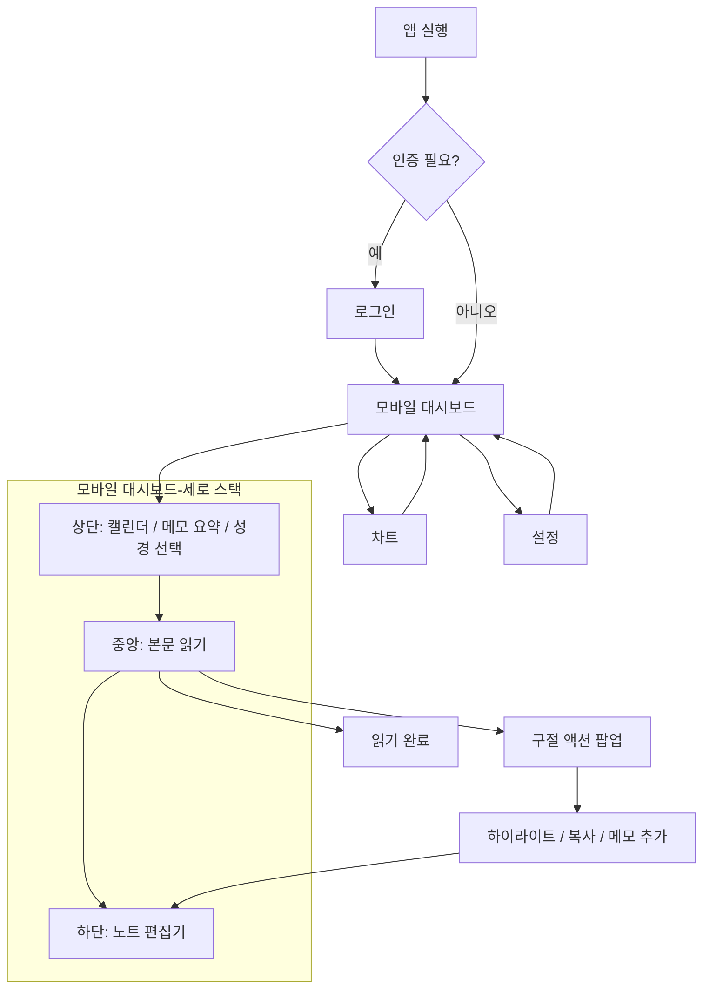
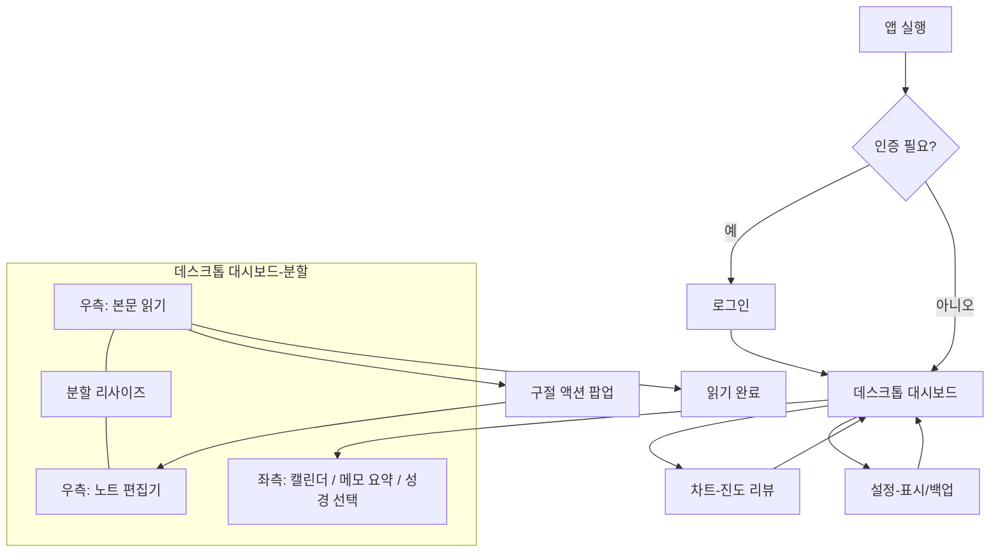

# 플로우 다이어그램
- 작성일자: 2026년 1월 12일
- 최신 갱신일자: 2026년 1월 12일

## 모바일 사용자

### 주요 목적: 짧은 세션에서 오늘 읽기 완료, 이동 중 간단 기록, 집중 모드 유지
- 시나리오 1(오늘 체크인): 앱 열기 → (로그인) → 오늘 날짜/본문 확인 → 읽기 → 완료 체크 → 종료
- 시나리오 2(이동 중 기록): 구절 탭 → 하이라이트/메모 입력 → 자동 저장 → 다음 구절 이동
- 시나리오 3(누락 보정): 캘린더에서 미읽은 날짜 선택 → 해당 장 이동 → 완료 체크 반복 → 진행률 확인
- 시나리오 4(집중 모드): 설정에서 캘린더 숨김/글꼴·테마 조정 → 대시보드 복귀 → 읽기 집중

### 모바일 플로우

## 데스크톱 사용자

### 주요 목적: 긴 세션의 심화 묵상, 읽기·메모 병렬 정리, 진척률 리뷰
- 시나리오 1(심화 묵상): 대시보드 열기 → 읽기/메모 분할 비율 조정 → 하이라이트/메모 삽입 → 완료 체크
- 시나리오 2(주간 리뷰): 차트 화면 이동 → OT/NT 필터로 진척 확인 → 다음 읽기 범위 결정 → 대시보드 복귀
- 시나리오 3(정리·보관): 설정에서 글꼴/표시 옵션 점검 → 백업 내보내기 → 필요 시 복구 검증
- 시나리오 4(교차 사용): 모바일에서 즉시 기록 → 데스크톱에서 메모 확장·정리 → 다음 읽기 계획 수립

### 데스크톱 플로우

