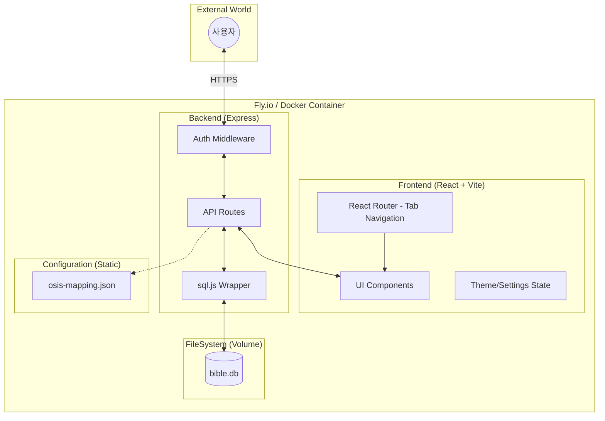
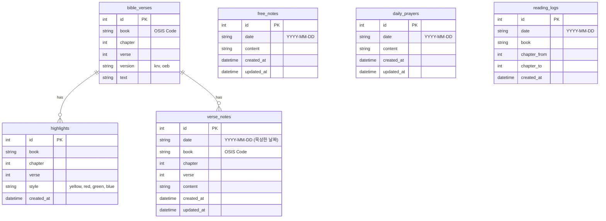

# 🏗️ System Architecture (v2.0)

> **Last Updated: 2026-01-24**

BibleMate v2.0의 시스템 구조와 설계 철학을 정리한 문서입니다.
v1.x 대비 **구절별 묵상 시스템**, **탭 기반 화면 분리**, **3-Column 레이아웃** 도입.

---

## 1. High-level Architecture



---

## 2. 핵심 설계 철학

### 1) 모드 분리 (Mode Separation)
- **말씀 집중 모드**: 순수 성경 본문에 집중, 양쪽 사이드바에 구절별 묵상 표시
- **묵상일지 모드**: 날짜 기반 묵상 기록 관리 및 읽기 진도 확인
- **이유**: 사용자 목적에 따른 명확한 UX 분리, 기능 혼재 방지

### 2) 데이터와 설정의 분리 (Separation of Concerns)
- **설정(Config)**: 빌드 시 포함되며 읽기 전용으로 취급 (`server/config/`)
- **데이터(Data)**: 앱 실행 중 변경되는 가변 데이터 (`server/data/`)
- **이유**: 클라우드 배포 시 볼륨 마운트 시 설정 파일이 유실되는 것을 방지

### 3) 구절 중심 묵상 (Verse-centric Meditation)
- 기존 날짜 기반 단일 노트 → 구절별 다중 노트 구조
- **3가지 묵상 유형**:
  | 유형 | 테이블 | 설명 |
  |------|--------|------|
  | 구절별 묵상 | `verse_notes` | 특정 성경 구절에 연결된 묵상 |
  | 자유 묵상 | `free_notes` | 구절과 무관한 일반 묵상 |
  | 오늘의 기도 | `daily_prayers` | 날짜별 기도 기록 |

- **데이터 저장/조회 기준**:
  | 항목 | 기준 | 다중 허용 |
  |------|------|:--------:|
  | 성경 읽기 기록 | 장(Chapter) + 날짜 | ✅ 같은 장 여러 날 읽기 가능 |
  | 구절별 묵상 | 구절(Verse) + 날짜 | ✅ 같은 구절 여러 날 묵상 가능 |
  | 자유 묵상/기도 | 날짜(Date) | ❌ 날짜당 1개 |

- **화면별 조회 차이**:
  - **말씀 집중 모드**: 해당 장의 모든 묵상 표시 (날짜 무관)
  - **묵상일지 모드**: 선택한 날짜에 작성된 묵상만 표시

### 4) 환경 기반 보안 (Environment-driven Security)
- 로컬 환경에서는 최대한의 편의성 제공 (암호 불필요)
- 외부 노출 환경(Fly.io 등)에서는 환경 변수(`ACCESS_PASSWORD`)만으로 즉시 보안 활성화
- **세션 정책**: 모든 세션은 서버 UTC 자정(00:00:00)에 강제 만료

### 5) 타임존 정책 (Timezone Policy)
- **서버 저장**: UTC 기준
- **클라이언트 표시**: 사용자 로컬 타임존 (KST 등)
- **날짜 문자열**: ISO 8601 (`YYYY-MM-DD`), 서버 UTC 자정 기준 계산
- **읽기 기록/묵상 조회**: UTC 자정 기준 날짜 필터링

---

## 3. 디렉토리 구조 및 역할

```bash
biblemate/
├── client/                    # 프론트엔드 (React, UI, UX)
│   └── src/
│       ├── pages/
│       │   ├── BiblePage.jsx      # [NEW] 말씀 집중 모드 (/bible)
│       │   ├── JournalPage.jsx    # [NEW] 묵상일지 모드 (/journal)
│       │   └── ...
│       └── components/
│           ├── TwoColumnViewer.jsx   # [NEW] 2단 성경 본문
│           ├── VerseSidebar.jsx      # [NEW] 구절별 묵상 사이드바
│           ├── VerseNoteEditor.jsx   # [NEW] 구절 묵상 편집 모달
│           └── ...
├── server/                    # 백엔드 (Express, API, Auth)
│   ├── config/                # 서비스 설정 (Read-only)
│   ├── db/                    # DB 초기화 및 스키마
│   ├── data/                  # SQLite 실제 파일 (Writable, Volume Mount)
│   └── routes/
│       ├── verse-notes.js     # [NEW] 구절별 묵상 API
│       ├── prayers.js         # [NEW] 기도 API
│       └── free-notes.js      # [NEW] 자유묵상 API
├── scripts/                   # 데이터 임포트 및 유틸리티
└── docs/                      # 설계 및 사용자 문서

### API Design Principles
- **RESTful**: 자원 중심 경로 설계
- **Stateless**: JWT/Session 쿠키 기반 인증
- **Error Handling**: 표준 에러 응답 포맷 준수
  - Body: `{ "code": "ERROR_CODE", "message": "Human readable message" }`
```

---

## 4. 데이터 구조 (Data Structure)

### 1) Database ERD (SQLite) - v2.0



### 2) Backup JSON Schema (v2.0)

```json
{
  "version": "2.0",
  "app_version": "2.0.0",
  "schema_version": 3,
  "exported_at": "2026-01-24T...",
  "data": {
    "reading_logs": [...],
    "verse_notes": [...],
    "free_notes": [...],
    "daily_prayers": [...],
    "highlights": [...]
  }
}
```

---

## 5. UI 아키텍처

### 반응형 레이아웃 전략

```
┌─────────────────────────────────────────────────────────────┐
│                    RESPONSIVE BREAKPOINT                     │
├─────────────────────────────────────────────────────────────┤
│   < 768px (Mobile)    │   >= 768px (Desktop/Tablet)         │
├───────────────────────┼─────────────────────────────────────┤
│  Single Column        │  3-Column Layout                    │
│  + Tab Navigation     │  Left Sidebar | Content | Right     │
│  + Bottom Actions     │  Sidebar (Verse Notes)              │
└───────────────────────┴─────────────────────────────────────┘
```

### 컴포넌트 계층 구조

```
App
├── Header (탭 네비게이션: 성경 읽기 | 묵상일지)
│
├── [말씀 집중 모드 - BiblePage]
│   ├── VerseSidebar (좌: 전반부 구절 묵상)
│   ├── TwoColumnViewer (중앙: 2단 성경 본문)
│   │   └── VerseText (📝 이모지 표시)
│   └── VerseSidebar (우: 후반부 구절 묵상)
│
├── [묵상일지 모드 - JournalPage]
│   ├── ReadingProgressSidebar (좌: 성경읽기표)
│   ├── DailyJournal (중앙: 날짜별 묵상)
│   │   ├── VerseNoteList (구절별 묵상)
│   │   ├── FreeNoteEditor (자유 묵상)
│   │   └── DailyPrayer (오늘의 기도)
│   └── CalendarSidebar (우: 달력 + 통계)
│
└── VerseNoteEditor (공통: 구절 묵상 작성 모달)
```

### UI State Handling Strategies
- **Loading**: 데이터 로딩 시 Skeleton UI 표시 (UX 끊김 방지)
- **Error**: API 호출 실패 시 Toast Notification 표시
- **Empty**: 데이터 부재 시 명확한 Empty State 컴포넌트 표시
- **Responsive**: 모바일 헤더 탭 명칭 축소 (`[성경]`, `[묵상]`) 등 공간 최적화

---

## 6. 양쪽 사이드바 묵상 분배 로직

### 핵심 알고리즘

```jsx
// 해당 장의 총 구절 수 기준으로 분배
const midpoint = Math.ceil(verses.length / 2);

// 전반부 구절 묵상 → 왼쪽 사이드바
const leftVerseNotes = verseNotes.filter(n => n.verse <= midpoint);

// 후반부 구절 묵상 → 오른쪽 사이드바
const rightVerseNotes = verseNotes.filter(n => n.verse > midpoint);
```

### 예시 (시편 23편, 6절)

| 분류 | 구절 범위 | 사이드바 |
|------|-----------|----------|
| 전반부 | 1-3절 | 좌측 |
| 후반부 | 4-6절 | 우측 |

---

## 7. 데이터 지속성 전략

- SQLite는 WASM 기반의 `sql.js`를 사용하며, 서버 종료 시점에 메모리 데이터를 파일로 쓰기(Write-back)함
- **표준 경로**: `server/data/bible.db`
- **볼륨 마운트**: Fly.io 배포 시 `biblemate_data` 볼륨을 `/app/server/data`에 마운트

---

## 8. 환경 일관성 (Environment Parity) 규칙

### 1) 데이터베이스 경로 엄수
- `server/db/init.js`의 `DB_PATH`는 반드시 `server/data/bible.db`를 지향함

### 2) 세션 및 상태 관리
- 서버 재시작 시 인메모리 세션이 초기화되므로, 프론트엔드는 항상 `authStatus`를 체크

### 3) 마이그레이션 호환성
- `schema_version` 체크 후 자동 마이그레이션 수행
- v1.x `notes` → v2.0 `free_notes` 자동 이관

---

## 9. 참고 문서

- [spec-v2.0.md](./spec-v2.0.md)
- [layout-v2.0.md](./layout-v2.0.md)
- [V2 UI/UX Redesign Planning](../01-planning/V2%20UI_UX%20Redesign%20Planning.md)
