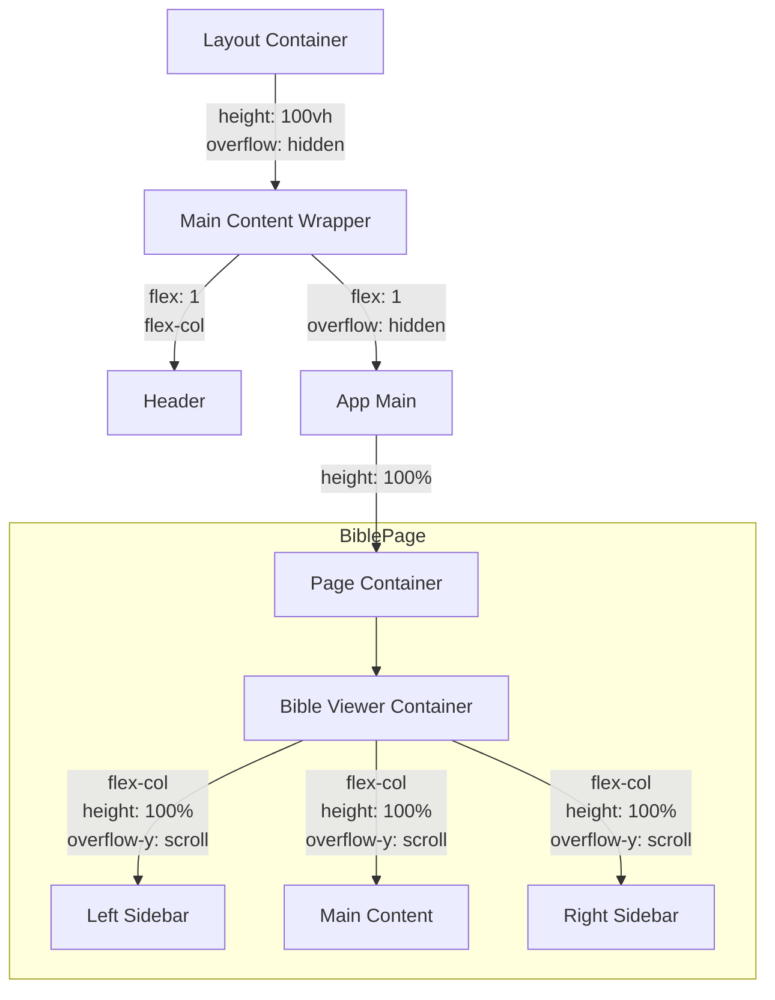

# UI/UX Layout Plan v2.0

> **Last Updated: 2026-01-25**

v2.0의 레이아웃 설계입니다.
핵심 변화: **탭 기반 모드 분리**, **3-Column 레이아웃**, **구절별 묵상 표시(📝)**.

---

## 1. 페이지 구조 (Sitemap)

```
/
├── /login              # 로그인 페이지
├── /bible              # [NEW] 말씀 집중 모드 (기본 화면)
├── /journal            # [NEW] 묵상일지 모드
├── /chart              # 성경 읽기표 (v1.4 유지)
└── /settings           # 설정 페이지
```

---

## 2. Layout Architecture & CSS Hierarchy

글로벌 스크롤(Window Scroll)을 방지하고, 각 콘텐츠 영역이 독립적으로 스크롤되도록 하는 레이아웃 구조입니다.

### 2.1 Layout Tree Structure



### 2.2 Key CSS Rules

**1. Root Layout (`Layout.css`)**
- `layout-container`: 뷰포트 전체 높이(`100vh`)를 차지하며, `overflow: hidden`으로 윈도우 스크롤을 차단합니다.
- `app-main`: 헤더를 제외한 나머지 영역을 채우며(`flex: 1`), 내부 스크롤을 허용하지 않고(`overflow: hidden`) 자식에게 위임합니다.

```css
.layout-container {
    display: flex;
    height: 100vh; /* Viewport 고정 */
    overflow: hidden; /* Global Scroll 방지 */
}

.app-main {
    flex: 1;
    overflow: hidden; /* 자식에게 스크롤 위임 */
    display: flex;
    flex-direction: column;
}
```

**2. Page Layout (e.g., `ReadingDashboard.css`)**
- 페이지 컨테이너는 부모(`app-main`)의 크기를 100% 채웁니다.
- 내부에서 필요한 영역(예: 사이드바, 본문)에만 `overflow-y: auto`를 부여하여 독립 스크롤을 구현합니다.

```css
.dashboard-container {
    height: 100%; /* 부모 높이 상속 */
    overflow: hidden; /* 페이지 자체 스크롤 방지 */
    display: flex;
    flex-direction: column;
}
```

**3. Component Layout (e.g., `BibleViewer.css`)**
- 각 패널(사이드바, 본문)은 `height: 100%`를 가지며 독립적으로 스크롤됩니다.

```css
.bible-side-panel,
.bible-main-content {
    height: 100%;
    overflow-y: auto; /* 독립 스크롤 */
}
```

**4. General Page Layout (e.g., `Settings.css`, `BibleChartPage.css`)**
- 일반 페이지(설정, 읽기표 등)는 내부 스크롤을 가져야 합니다.
- 부모(`app-main`)의 `100%` 높이를 상속받고, `overflow-y: auto`를 적용합니다.

```css
.page-settings,
.chart-page-container {
    height: 100%;       /* 부모 높이 채움 */
    overflow-y: auto;   /* 내부 스크롤 허용 */
    overflow-x: hidden;
}
```

---

## 3. 상세 레이아웃

### 3.1 공통 헤더 (Header)

```
┌────────────────────────────────────────────────────────────────────┐
│ 📖 Bible Mate    [성경 읽기]  [묵상일지]           [🌙] [⚙️]       │
│                   ──────────                                       │
│                   (Active Tab Indicator)                           │
└────────────────────────────────────────────────────────────────────┘
```

- **탭 네비게이션**: `성경 읽기` (BiblePage) | `묵상일지` (JournalPage)
- **아이콘 버튼**: 다크모드 토글(🌙/☀️), 설정(⚙️)
- **참고**: 읽기표는 묵상일지에 포함되어 있으므로 헤더에서 제거

---

### 3.2 말씀 집중 모드 (BiblePage) - Desktop

**3-Column 레이아웃**: 양쪽 사이드바 + 중앙 2단 본문

```
┌──────────────────────────────────────────────────────────────────────────┐
│ Header: [성경 읽기] [묵상일지]                                [🌙] [⚙️] │
├─── 좌측 사이드바 (20%) ──┬───── 중앙 본문 (60%) ─────┬── 우측 사이드바 ──┤
│                          │   ◀ 시편 23장   ▶         │                   │
│ ┌─ 1절 묵상 ───────────┐ │                           │ ┌─ 4절 묵상 ─────┐ │
│ │ 📖 "여호와는 나의..."  │ │ ┌─────────┬─────────┐ │ │ 📖 "사망의..."   │ │
│ │ 주님이 목자가 되어... │ │ │ 1절📝   │  4절    │ │ │ 어두운 골짜기... │ │
│ └────────────────────┘ │ │ 2절📝   │  5절📝  │ │ └────────────────┘ │
│                          │ │ 3절     │  6절    │ │                   │
│ ┌─ 2절 묵상 ───────────┐ │ └─────────┴─────────┘ │ ┌─ 5절 묵상 ─────┐ │
│ │ 📖 "그가 나를..."     │ │                           │ │ 📖 "원수의..."   │ │
│ │ 쉴 만한 물가로...    │ │   [ 읽기 완료 ✓ ]         │ │ 주님이 기름을... │ │
│ └────────────────────┘ │ │                           │ └────────────────┘ │
│                          │                           │                   │
└──────────────────────────┴───────────────────────────┴───────────────────┘
                                      ⬆
                    구절 클릭 시 → [하이라이트] [묵상 작성] 선택
```

**구절별 묵상 표시 (📝 이모지)**:
- 묵상이 존재하는 구절: 텍스트 끝에 📝 표시
- 클릭 시: 구절 팝업이 활성화되며, 해당 구절에 이미 남긴 묵상이 있을 경우 '묵상 보기' 버튼을 통해 팝업 내에서 바로 확인 가능
- **모바일 제스처**: 좌우 스와이프를 통해 이전/다음 장으로 이동 가능

**사이드바 분배 로직**:
- 좌측 사이드바: 1 ~ ⌈N/2⌉절 묵상
- 우측 사이드바: ⌈N/2⌉+1 ~ N절 묵상

**사이드바 데이터 조회 기준**:
- 해당 장의 **모든 구절별 묵상** 표시 (날짜 무관)
- 정렬: 구절 번호순 → 날짜 최신순
- 같은 구절에 여러 날 묵상이 있으면 모두 표시

---

### 3.3 묵상일지 모드 (JournalPage) - Desktop

**3-Column 레이아웃**: 성경읽기표 + 날짜별 묵상 + 달력/통계

```
┌──────────────────────────────────────────────────────────────────────────┐
│ Header: [성경 읽기] [묵상일지]                                [🌙] [⚙️] │
├─── 좌측 (20%) ───────┬──────── 중앙 (60%) ─────────┬─── 우측 (20%) ─────┤
│                       │                             │                     │
│ 📊 성경 읽기표        │ 📅 2026년 1월 24일 (금)     │  ┌─ 1월 ─────────┐ │
│                       │                             │  │ 일 월 화 수... │ │
│ [ 구약 ] [ 신약 ]     │ ── 읽은 말씀 ────────────   │  │ [1][2][●]...  │ │
│                       │ 📖 시편 23:1-6 →            │  └───────────────┘ │
│ 창세기 ██████░░ 40/50 │                             │                     │
│ 출애굽기 ███░░░ 20/40 │ ── 구절별 묵상 (2) ───────  │  ── 이번 달 ─────   │
│ ...                   │ ┌─ 1절 ─────────────────┐ │  📖 읽은 장: 45     │
│                       │ │ "여호와는 나의..." 📖  │ │  ✏️ 묵상 수: 12     │
│                       │ │ 주님이 목자가...  ✏🗑 │ │                     │
│                       │ └─────────────────────┘ │  ── 가장 많이 읽은 ─ │
│                       │ ┌─ 5절 ─────────────────┐ │  📕 시편 (15장)     │
│                       │ │ "원수의 목전에..." 📖 │ │  📗 창세기 (10장)   │
│                       │ │ 주님이 기름을... ✏🗑 │ │                     │
│                       │ └─────────────────────┘ │                     │
│                       │                             │                     │
│                       │ ── 자유 묵상 ────────────   │                     │
│                       │ 오늘 말씀을 통해...  ✏🗑   │                     │
│                       │                             │                     │
│                       │ ── 오늘의 기도 ──────────   │                     │
│                       │ 주님, 오늘도 인도해...✏🗑  │                     │
│                       │                             │                     │
└───────────────────────┴─────────────────────────────┴─────────────────────┘
```

**편집/삭제 아이콘**: 각 항목에 ✏(편집) 🗑(삭제) 인라인 표시

**데이터 조회 기준**:
- **선택한 날짜에 작성된 항목만** 표시
- 읽은 말씀: `reading_logs WHERE date = 선택일`
- 구절별 묵상: `verse_notes WHERE date = 선택일`
- 자유 묵상/기도: `free_notes`, `daily_prayers WHERE date = 선택일`

---

### 3.4 구절 클릭 → 묵상 작성 팝업

```
┌─────────────────────────────────────────────────────────────┐
│                      📝 묵상 작성                     [ ✕ ] │
├─────────────────────────────────────────────────────────────┤
│                                                             │
│  📖 시편 23:1                                               │
│  ┌─────────────────────────────────────────────────────┐   │
│  │ "여호와는 나의 목자시니 내게 부족함이 없으리로다"    │   │
│  └─────────────────────────────────────────────────────┘   │
│                                                             │
│  ✏️ 묵상 내용                                               │
│  ┌─────────────────────────────────────────────────────┐   │
│  │                                                     │   │
│  │ (텍스트 입력 영역)                                   │   │
│  │                                                     │   │
│  │                                                     │   │
│  └─────────────────────────────────────────────────────┘   │
│                                                             │
│                           [ 취소 ]  [ 💾 저장 ]             │
│                                                             │
└─────────────────────────────────────────────────────────────┘
```

- **팝업 크기**: 화면의 50% 이상
- **구절 표시**: 상단에 선택한 구절 본문 (이탤릭, 세리프)
- **입력 영역**: 충분한 높이의 textarea

---

### 3.5 모바일 레이아웃 (< 768px)

#### 말씀 집중 모드 (Mobile)

```
┌─────────────────────────────────┐
│ [성경] [묵상] [📊][🌙][⚙️]      │  ← 상단 탭 (명칭 축소)
├─────────────────────────────────┤
│ ◀ 시편 23장                 ▼  │  ← 책/장 선택
├─────────────────────────────────┤
│                                 │
│  1 여호와는 나의... 📝          │
│  2 그가 나를 푸른... 📝         │  ← 1단 본문
│  3 내 영혼을 소생...            │     (📝 = 묵상 존재)
│  4 사망의 음침한...             │
│  ...                            │
│                             │
├─────────────────────────────┤
│       [ 읽기 완료 ✓ ]       │  ← 하단 액션
└─────────────────────────────┘
```

- 구절 탭 시 → 하이라이트/묵상 선택 팝업
- 📝 탭 시 → 해당 구절 묵상 보기/편집 모달

#### 묵상일지 모드 (Mobile)

```
┌─────────────────────────────────┐
│ [성경] [묵상] [📊][🌙][⚙️]      │  ← 상단 탭 (명칭 축소)
├─────────────────────────────────┤
│ ◀ 2026년 1월 24일 (금) ▶       │  ← 날짜 네비게이션
├─────────────────────────────────┤
│ 📖 읽은 말씀                    │
│ 시편 23:1-6 →                  │  ← 클릭 시 성경 이동
├─────────────────────────────┤
│ ✏️ 구절별 묵상 (2)          │
│ ┌─ 1절 ──────────────────┐ │
│ │ "여호와는 나의..."      │ │
│ │ 주님이 목자가... ✏🗑    │ │
│ └────────────────────────┘ │
│ ┌─ 5절 ──────────────────┐ │
│ │ "원수의 목전에..."      │ │
│ │ 주님이 기름을... ✏🗑    │ │
│ └────────────────────────┘ │
├─────────────────────────────┤
│ 📝 자유 묵상                │
│ 오늘 말씀을 통해...  ✏🗑   │
├─────────────────────────────┤
│ 🙏 오늘의 기도              │
│ 주님, 인도해 주세요... ✏🗑 │
└─────────────────────────────┘
```

- 날짜별 세로 스크롤
- 좌우 스와이프로 날짜 이동 (선택적 제스처)

---

## 4. 디자인 시스템 (Design System) v2.0

### New Components

| 컴포넌트 | 설명 |
|----------|------|
| **Tab Navigation** | 상단 탭: Active = Primary 밑줄 + Bold |
| **Verse Note Card** | 좌측 파란 보더 + 구절 인용 + 묵상 텍스트 |
| **Note Indicator (📝)** | 구절 끝 이모지, 호버 시 pointer cursor |
| **Action Icons** | ✏(편집) 🗑(삭제) 인라인 아이콘, 호버 시 표시 |
| **Verse Quote** | 이탤릭 + 세리프 폰트 (Nanum Myeongjo) |
| **Two Column Text** | CSS `column-count: 2`, 균등 분배 |
| **Empty State** | 아이콘 + 안내 문구 + 액션 버튼 (중앙 정렬) |
| **Skeleton UI** | 데이터 로딩 시 텍스트/이미지 형태의 회색 박스 애니메이션 |
| **Verse Badge** | 묵상 카드에 "3절", "5절" 뱃지로 본문과 시각적 연결 |

### Highlight Colors (4색)

| 색상 | 변수 | Hex |
|------|------|-----|
| 노랑 | `--highlight-yellow` | `#FFF9C4` |
| 빨강 | `--highlight-red` | `#FFCDD2` |
| 초록 | `--highlight-green` | `#C8E6C9` |
| 파랑 | `--highlight-blue` | `#BBDEFB` |

### Responsive Breakpoints

| Breakpoint | 레이아웃 |
|------------|----------|
| `< 400px`  | Ultra-Small Mobile (Ex: iPhone 13 mini) - 요소 겹침 방지를 위해 헤더 요소 중앙 정렬 및 자동 줄바꿈 적용 |
| `< 768px`  | Mobile (Single Column) |
| `>= 768px` | Desktop/Tablet (3-Column) |

---

## 5. 참고 문서

- [spec-v2.0.md](./spec-v2.0.md)
- [architecture-v2.0.md](./architecture-v2.0.md)
- [V2 UI/UX Redesign Planning](../01-planning/V2%20UI_UX%20Redesign%20Planning.md)
