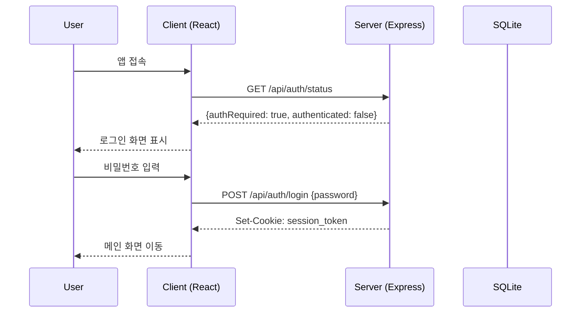
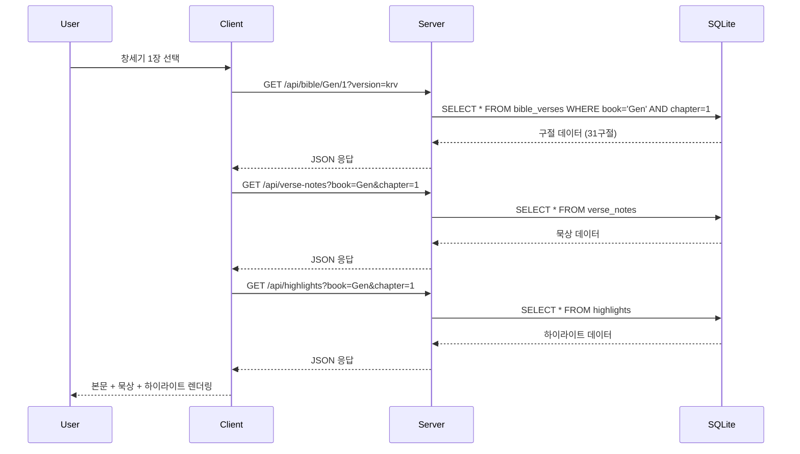
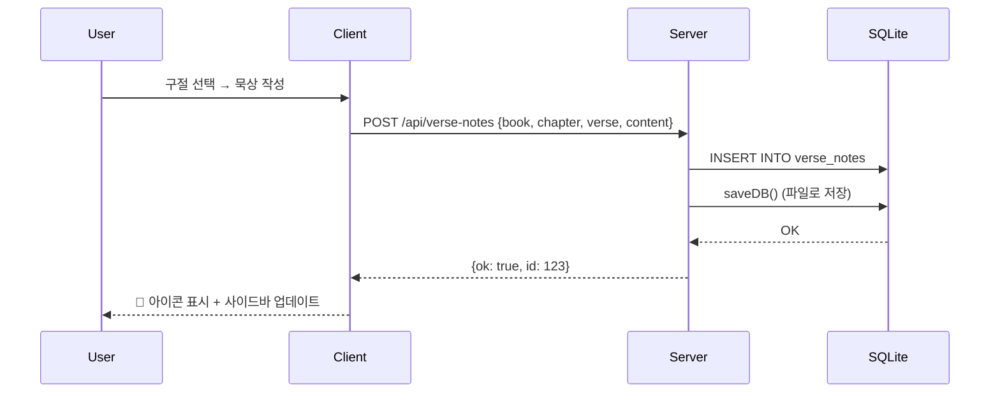
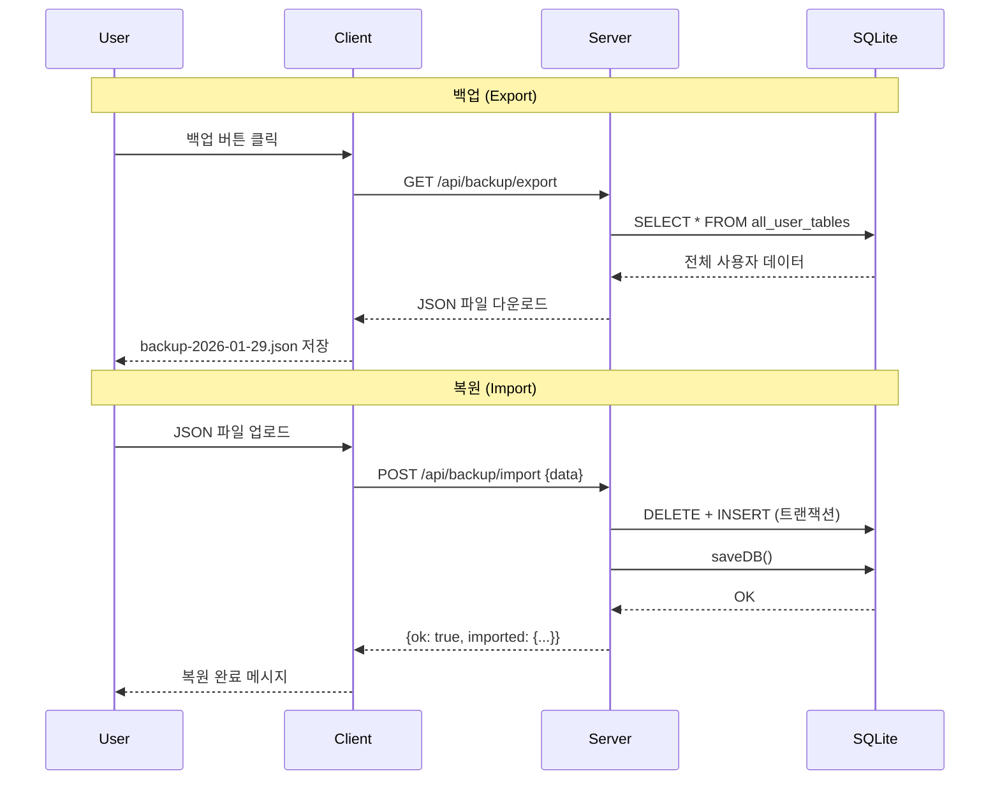
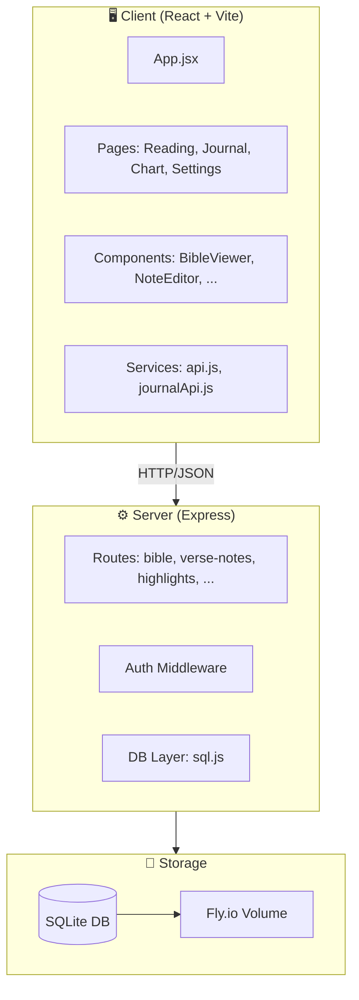

# BibleMate 시스템 흐름도 (Sequence Diagrams)

> 생성일: 2026-01-29 | 버전: v2.0.1

---

## 1. 인증 흐름 (Authentication Flow)

---

## 2. 성경 읽기 흐름 (Bible Reading Flow)

---

## 3. 묵상 저장 흐름 (Verse Note Save Flow)

---

## 4. 백업/복원 흐름 (Backup & Restore Flow)

---

## 5. 전체 아키텍처 (System Architecture)

---

## 6. DB 테이블 구조 (Schema V3)

| 테이블 | 용도 |
|--------|------|
| `bible_verses` | 성경 본문 (66권, 31,000+ 구절) |
| `reading_logs` | 읽기 기록 |
| `highlights` | 형광펜 하이라이트 |
| `verse_notes` | 구절별 묵상 |
| `free_notes` | 자유 묵상 |
| `daily_prayers` | 오늘의 기도 |
| `user_settings` | 사용자 설정 |
| `notes` | 레거시 (deprecated) |
