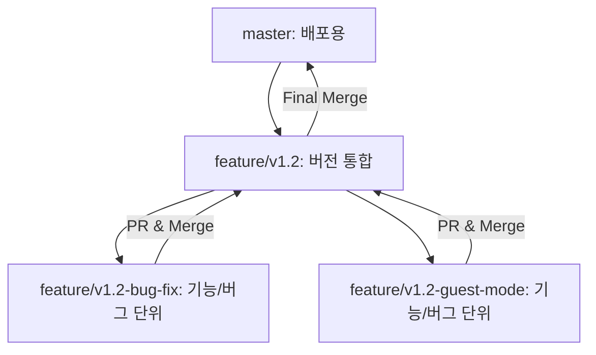

# Bible Reading Mate 개발 방법론 (Dev Methodology)

- 최초 생성일: 2026-01-05
- 최신 수정일: 2026-01-08

본 프로젝트는 코드의 안정성과 개발자의 학습을 위해 다음과 같은 **브런칭 전략**, **버전 관리 기준**, 그리고 **작업 흐름**을 따릅니다.

## 1. 문서 작성 원칙

모든 문서는 `docs/` 폴더 안에서 개발 **Lifeycle** 단계별로 관리됩니다.
- `docs-index.md`에 문서 목록을 정리합니다.
- `docs/01-planning/`: 기획, 로드맵, 아이디어 제안서 등 (Before)
- `docs/02-specs/`: 요구사항 명세서, 아키텍처, 디자인 등 (Design)
- `docs/03-logs/`: 개발 로그, 검증 리포트, PR 초안 등 (Process)
- `docs/04-releases/`: 릴리즈 노트 (After)
- `docs/guides/`: 개발 방법론, 배포 가이드 등 (Reference)
- `docs/assets/`: 목업, 스크린샷, 테스트 데이터 등 (Assets)

문서 작성 시 담백한 엔지니어링 스타일을 유지합니다. 개발 내역을 과장하지 마십시오.

---

## 2. AI 협업 규칙 (Collaboration Gate)
- **승인 없이 변경 금지**: 명세의 요구사항을 변경/생략할 경우 반드시 사전 질문 후 승인을 받습니다.
- **결정 필요 시 즉시 정지**: 판단이 필요한 지점에서는 구현을 멈추고 **"이유 → 선택지 → 장단점 → 추천안"** 순서로 제안합니다.
- **개발 로그 기록**: 모든 구현 결과와 결정 사항은 '개발 로그 업데이트' 단계를 통해 `docs/03-logs/dev-log-vX.Y.md`에 공식 기록합니다.

---

## 3. 기능 선정 및 계획 (Selection & Planning)

개발을 시작하기 전, **Inbox**를 통해 아이디어를 수집하고 차기 버전의 범위를 확정하는 단계를 거칩니다.

1.  **아이디어 수집 (Inbox)**: 희망 기능이나 발견된 버그를 `01-planning/roadmap.md`의 **Inbox** 섹션에 자유롭게 기록합니다.
2.  **분류 및 가치 매핑 (Categorization)**: 수집된 아이템을 `[Major]`, `[Minor]`, `[Patch]`로 분류하고 핵심 가치와 매핑합니다.
3.  **목표 설정 (Scoping)**: 차기 버전에 포함할 핵심 기능을 선별하고, `roadmap.md` 상단에 **목표 버전**과 **개발 일정**을 명시합니다.
4.  버전 통합 브랜치 생성: `feature/vX.Y` 브랜치를 생성합니다.
5.  **범위 명세서 작성 (Version Specification)**: 확정된 범위를 바탕으로 `02-specs/spec-v버전명.md`를 작성하여 해당 버전의 구현 범위와 기술적 변경 사항을 정의합니다.

---

## 4. 브랜치 전략 (Branching Strategy)

프로젝트는 **버전(Version)** 브랜치와 **기능(Feature)** 브랜치로 이중화하여 관리합니다.
(`/feature` 워크플로우를 통해 안전하게 브랜치 생성 및 작업 준비를 할 수 있습니다.)

- **`master`**: 항상 배포 가능한 최신/안정 상태를 유지합니다.
- **`feature/vX.Y` (통합 브랜치)**: 특정 버전의 모든 기능을 모으는 중간 기지입니다. 명세서(`spec`)와 로드맵이 관리됩니다.
- **`feature/vX.Y-기능명` (작업 브랜치)**: 실제로 코드를 수정하는 단위입니다. 작업 완료 후 통합 브랜치로 병합됩니다.

---

## 5. 버전 관리 기준 (Versioning Policy)

### Major 버전 (2.0, 3.0, ...)
- 대규모 아키텍처 변경이나 핵심 사용자 경험이 근본적으로 바뀔 때.
- 예: DB 스키마 대폭 변경, 핵심 기능 재설계.

### Minor 버전 (1.1, 1.2, ...)
- 기존 구조 내에서 기능을 추가하거나 개선할 때.
- 예: 신규 기능 추가, UI/UX 개선, 성능 향상.

### Patch 버전 (1.1.1, 1.1.2, ...)
- 긴급 버그 수정이나 사소한 변경.
- 예: 핫픽스, 오타 수정, 보안 패치.

---

## 6. 작업 수행 흐름 (Development Workflow)

모든 작업(Feature/Bug fix)은 다음의 **6단계 승인 게이트**를 거칩니다.

### 1단계: 기능 브랜치 생성
- `/feature` 워크플로우를 실행하여 기능 브랜치를 생성하고, 구현 계획 및 태스크 목록을 초기화합니다.
- Hot fix의 경우 난이도가 간단할 경우, 사용자의 승인 하에 브랜치를 생성하지 않고 `master` 브랜치에서 바로 작업할 수 있습니다.

### 2단계: 구현 계획 작성 (Implementation Planning)
- 수정 전, `docs/01-planning/implementation-plans/implementation-plan-vX.Y.Z-기능명.md`를 **아티팩트**로 작성하여 제출합니다.
  - **변경 범위**: 수정할 파일/컴포넌트, 수정된 코드의 주요 내용 혹은 변경 로직
  - **기대 결과**: 변경 후의 기능 동작
  - **변경 단계**: 변경의 작업 단계별 내용, 검증 절차 및 전략
    - **검증 절차**: 각 작업이 끝날 때마다 검증을 수행한 후 다음 단계로 진행합니다.
    - **검증 전략**: 자동화 테스트 및 AI 자체/사용자 수동 검증 방법 및 기준
    - **검증 포인트**: 기존 기능과의 충돌 여부, 사용자 경험에 의한 특이/에러 케이스 통과 여부
  

### 3단계: 작업별 구현 및 검증
- 구현 계획을 작업별로 구현하고, AI가 자체 검증 결과를 포함한 `docs/03-logs/walkthroughs/walkthrough-vX.Y.Z-기능명.md`를 제출합니다.
- 구현 시 `docs/lessons.md`를 참고하여 구현합니다.
- 사용자가 로컬 서버(`npm run dev`)에서 기능을 직접 확인합니다. 
- 동작이 의도와 같을 경우 작업 승인 후 다음 작업으로 넘어갑니다.
- 마지막 작업까지 끝나면 다음으로 넘어갑니다.

### 4단계: PR 초안 작성 및 리뷰
- `/pr` 워크플로우를 실행하여 **PR(Pull Request) 초안**을 생성하고 **교훈** 기록란을 엽니다.
- AI가 코드 변경점과 검증 내용이 담긴 초안을 `docs/03-logs/pr/` 폴더에 작성합니다.
- PR 초안을 사용자에게 제출합니다.
- PR 초안이 사용자 검증을 통과할 경우 PR 승인 후 다음으로 넘어갑니다.

### 5단계: 개발 로그 업데이트 (Retrospective)
- PR 승인 후, `docs/03-logs/dev-log-v버전명.md`에 개발 과정을 기록합니다.
  - **Retrospective**: 문제점 및 해결 과정, 교훈(Lessons Learned)
- 개발 과정의 핵심 lessons learned를 `docs/lessons.md`에 기록합니다.

### 6단계: 최종 병합 (Merge)
- 기능을 통합 브랜치로 병합하고 기능 브랜치를 삭제합니다.
- 통합 브랜치의 모든 구현이 완료되면 `master` 브랜치로 병합합니다.

---

## 7. 배포 절차 (Release Process)
(`/deploy` 워크플로우를 사용하면 이 절차를 안전하게 수행할 수 있습니다.)

1. **버전 업데이트**: `package.json`, `Settings.jsx`, `README.md`, `roadmap.md` 갱신
2. **최종 병합**: 통합 브랜치를 `master`로 병합 (Squash Merge 권장)
3. **태그 및 릴리즈**: Git 태그 생성 (`v1.2.0` 등)
4. **릴리즈 노트 작성**: `docs/04-releases/release-notes-vX.Y.md` 생성
5. **문서 정리**: Roadmap 완료 처리(Inbox 및 Categorized item의 구현 항목 삭제, Completed 섹션에 구현 항목 추가) 및 `docs-index.md` 업데이트
6. **브랜치 정리**: 작업이 완료된 기능/통합 브랜치 삭제 (Local & Remote)

---

## 8. Lessons Learned (교훈)
- **문서화는 필수**: 코드는 잊혀지지만 문서는 남습니다. AI 협업 컨텍스트 유지에 핵심입니다.
- **체크리스트의 힘**: 머리로 기억하지 말고 `task.md`를 믿으세요.
- **아티팩트 주의**: 중요한 문서는 프로젝트 폴더 내 실제 파일로 저장하여 관리합니다.
- **Data & Environment Constancy**: 데이터베이스 경로(`server/data/`)와 서버 설정(.env)은 표준을 준수합니다.

> 💡 **핵심**: 이 프로세스는 코드의 품질을 보장할 뿐만 아니라, 개발자가 전체 개발 주기를 건강하게 경험하며 성장하는 데 목적이 있습니다.

