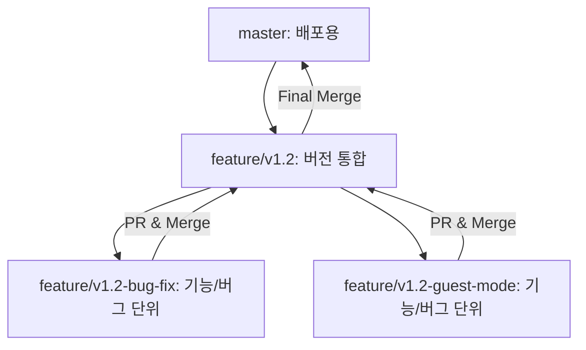

# Bible Reading Mate 개발 방법론 (Dev Methodology)

- 최초 생성일: 2026-01-05
- 최신 수정일: 2026-01-30

본 프로젝트는 코드의 안정성과 개발자의 학습을 위해 다음과 같은 **브런칭 전략**, **버전 관리 기준**, **Sub-agent 시스템**, 그리고 **작업 흐름**을 따릅니다.

## 1. 문서 작성 원칙

모든 문서는 `docs/` 폴더 안에서 개발 **Lifeycle** 단계별로 관리됩니다.
- `docs-index.md`에 문서 목록을 정리합니다.
- `docs/01-planning/`: 기획, 로드맵, 아이디어 제안서 등 (Before)
- `docs/02-specs/`: 요구사항 명세서, 아키텍처, 디자인 등 (Design)
- `docs/03-logs/`: 개발 로그, 검증 리포트, PR 초안 등 (Process)
- `docs/04-releases/`: 릴리즈 노트 (After)
- `docs/guides/`: 개발 방법론, 배포 가이드 등 (Reference)
- `docs/assets/`: 목업, 스크린샷, 테스트 데이터 등 (Assets)

문서 작성 시 담백한 엔지니어링 스타일을 유지합니다. 개발 내역을 과장하지 마십시오.

---

## 2. AI 협업 규칙 (Collaboration Gate)
- **승인 없이 변경 금지**: 명세의 요구사항을 변경/생략할 경우 반드시 사전 질문 후 승인을 받습니다.
- **결정 필요 시 즉시 정지**: 판단이 필요한 지점에서는 구현을 멈추고 **"이유 → 선택지 → 장단점 → 추천안"** 순서로 제안합니다.
- **개발 로그 기록**: 모든 구현 결과와 결정 사항은 '개발 로그 업데이트' 단계를 통해 `docs/03-logs/dev-log-vX.Y.md`에 공식 기록합니다.

---

## 3. Sub-agent 시스템

프로젝트는 6개의 **역할별 Sub-agent**를 활용하여 계획 검토 및 코드 리뷰를 수행합니다.

### Sub-agent 목록

| Agent | 역할 | `/feature` | `/pr` |
|-------|------|:----------:|:-----:|
| 🧪 **QA 엔지니어** | 테스트 전략, 품질 게이트 | ✅ | ✅ |
| 🔐 **보안 개발자** | 취약점 스캔, 인증/인가 | - | ✅ |
| 🎨 **UI/UX 디자이너** | 사용성, 접근성 | ✅ | ✅ |
| ✨ **인터렉션 디자이너** | 애니메이션, 피드백 | ✅ | ✅ |
| 💻 **프론트엔드 개발자** | 컴포넌트 구조, 상태관리 | ✅ | - |
| 🔧 **백엔드 개발자** | API 설계, DB 쿼리 | ✅ | ✅ |

### Sub-agent 적용 시점
- **`/feature`**: 구현 계획 작성 후, 각 Sub-agent가 계획을 검토하여 피드백 제공
- **`/pr`**: PR 작성 전, 보안/QA 및 구현 일치 여부 검토

### 의견 충돌 해결
Agent들의 의견이 충돌할 경우, **3가지 수정안**을 이유/장단점과 함께 제시하고 사용자가 최종 결정합니다.

```markdown
## 🔀 의견 충돌 해결
**충돌 내용**: (예: 보안 vs UX)

### 옵션 A: (보안 우선)
- **이유/장점/단점**: ...

### 옵션 B: (UX 우선)
- **이유/장점/단점**: ...

### 옵션 C: (절충안)
- **이유/장점/단점**: ...

**권장**: 옵션 X (이유 설명)
```

---

## 4. 기능 선정 및 계획 (Selection & Planning)

개발을 시작하기 전, **Inbox**를 통해 아이디어를 수집하고 차기 버전의 범위를 확정하는 단계를 거칩니다.
(`/plan` 워크플로우를 통해 진행할 수 있습니다.)

1.  **아이디어 수집 (Inbox)**: 희망 기능이나 발견된 버그를 `01-planning/roadmap.md`의 **Inbox** 섹션에 자유롭게 기록합니다.
2.  **분류 및 가치 매핑 (Categorization)**: 수집된 아이템을 `[Major]`, `[Minor]`, `[Patch]`로 분류하고 핵심 가치와 매핑합니다.
3.  **목표 설정 (Scoping)**: 차기 버전에 포함할 핵심 기능을 선별하고, `roadmap.md` 상단에 **목표 버전**과 **개발 일정**을 명시합니다.
4.  버전 통합 브랜치 생성: `feature/vX.Y` 브랜치를 생성합니다.
5.  **범위 명세서 작성 (Version Specification)**: 확정된 범위를 바탕으로 `02-specs/spec-v버전명.md`를 작성하여 해당 버전의 구현 범위와 기술적 변경 사항을 정의합니다.

---

## 5. 브랜치 전략 (Branching Strategy)

프로젝트는 **버전(Version)** 브랜치와 **기능(Feature)** 브랜치로 이중화하여 관리합니다.
(`/branch` 워크플로우를 통해 안전하게 브랜치 생성 및 작업 준비를 할 수 있습니다.)



- **`master`**: 항상 배포 가능한 최신/안정 상태를 유지합니다.
- **`feature/vX.Y` (통합 브랜치)**: 특정 버전의 모든 기능을 모으는 중간 기지입니다. 명세서(`spec`)와 로드맵이 관리됩니다.
- **`feature/vX.Y-기능명` (작업 브랜치)**: 실제로 코드를 수정하는 단위입니다. 작업 완료 후 통합 브랜치로 병합됩니다.

---


## 6. 버전 관리 기준 (Versioning Policy)

### Major 버전 (2.0, 3.0, ...)
- 대규모 아키텍처 변경이나 핵심 사용자 경험이 근본적으로 바뀔 때.
- 예: DB 스키마 대폭 변경, 핵심 기능 재설계.
- **Major 출시 후**: `/refactoring` 워크플로우로 코드 효율성 점검 권장.

### Minor 버전 (1.1, 1.2, ...)
- 기존 구조 내에서 기능을 추가하거나 개선할 때.
- 예: 신규 기능 추가, UI/UX 개선, 성능 향상.

### Patch 버전 (1.1.1, 1.1.2, ...)
- 긴급 버그 수정이나 사소한 변경.
- 예: 핫픽스, 오타 수정, 보안 패치.

---

## 7. 작업 수행 흐름 (Development Workflow)

모든 작업(Feature/Bug fix)은 다음의 **6단계 승인 게이트**를 거칩니다.

### 1단계: 기능 브랜치 생성 (`/feature`)
- `/feature` 워크플로우를 실행하여 기능 브랜치를 생성하고, 구현 계획 및 태스크 목록을 초기화합니다.
- Hot fix의 경우 난이도가 간단할 경우, 사용자의 승인 하에 브랜치를 생성하지 않고 `master` 브랜치에서 바로 작업할 수 있습니다.

### 2단계: 구현 계획 작성 (Implementation Planning)
- 수정 전, `docs/01-planning/implementation-plans/implementation-plan-vX.Y.Z-기능명.md`를 **아티팩트**로 작성하여 제출합니다.
  - **변경 범위**: 수정할 파일/컴포넌트, 수정된 코드의 주요 내용 혹은 변경 로직
  - **기대 결과**: 변경 후의 기능 동작
  - **변경 단계**: 변경의 작업 단계별 내용, 검증 절차 및 전략

### 2.5단계: Sub-agent 계획 검토 ⭐ (NEW)
- 구현 계획 작성 후, 5개 Sub-agent가 각 관점에서 계획을 검토합니다.
  - 🧪 QA 엔지니어 → 테스트 전략 평가
  - 🎨 UI/UX 디자이너 → 사용자 여정 검토
  - ✨ 인터렉션 디자이너 → 애니메이션/피드백 검토
  - 💻 프론트엔드 개발자 → 컴포넌트 구조 검토
  - 🔧 백엔드 개발자 → API 설계 검토
- 검토 결과는 `implementation_plan.md`의 **Agent Review** 섹션에 추가됩니다.
- 의견 충돌 시 3가지 수정안 제시 → 사용자 결정

### 3단계: 작업별 구현 및 검증
- 구현 계획을 작업별로 구현하고, AI가 자체 검증 결과를 포함한 `docs/03-logs/walkthroughs/walkthrough-vX.Y.Z-기능명.md`를 제출합니다.
- 구현 시 `docs/lessons.md`를 참고하여 구현합니다.
- 사용자가 로컬 서버(`npm run dev`)에서 기능을 직접 확인합니다. 
- 동작이 의도와 같을 경우 작업 승인 후 다음 작업으로 넘어갑니다.
- 마지막 작업까지 끝나면 다음으로 넘어갑니다.

### 4단계: PR 초안 작성 및 리뷰 (`/pr`)
- `/pr` 워크플로우를 실행하여 **PR(Pull Request) 초안**을 생성하고 **교훈** 기록란을 엽니다.
- **Sub-agent 코드 리뷰** ⭐ (NEW):
  - 🔐 보안 개발자 → 취약점 스캔
  - 🧪 QA 엔지니어 → 테스트 실행 확인
  - 🎨 UI/UX 디자이너 → 계획 대비 구현 일치 확인
  - ✨ 인터렉션 디자이너 → 계획 대비 구현 일치 확인
  - 🔧 백엔드 개발자 → API 구현 검토
- 검토 결과는 PR 초안의 **Agent Review** 섹션에 추가됩니다.
- 의견 충돌 시 3가지 수정안 제시 → 사용자 결정
- PR 초안이 사용자 검증을 통과할 경우 PR 승인 후 다음으로 넘어갑니다.

### 5단계: 개발 로그 업데이트 (`/dev-log`)
- PR 승인 후, `docs/03-logs/dev-log-v버전명.md`에 개발 과정을 기록합니다.
  - **Retrospective**: 문제점 및 해결 과정, 교훈(Lessons Learned)
- 개발 과정의 핵심 lessons learned를 `docs/lessons.md`에 기록합니다.

### 6단계: 최종 병합 (Merge)
- 기능을 통합 브랜치로 병합하고 기능 브랜치를 삭제합니다.
- 통합 브랜치의 모든 구현이 완료되면 `master` 브랜치로 병합합니다.

---

## 8. 배포 절차 (Release Process)
(`/deploy` 워크플로우를 사용하면 이 절차를 안전하게 수행할 수 있습니다.)

1. **버전 업데이트**: `package.json`, `Settings.jsx`, `README.md`, `roadmap.md` 갱신
2. **최종 병합**: 통합 브랜치를 `master`로 병합 (Squash Merge 권장)
3. **태그 및 릴리즈**: Git 태그 생성 (`v1.2.0` 등)
4. **릴리즈 노트 작성**: `docs/04-releases/release-notes-vX.Y.md` 생성
5. **문서 정리**: Roadmap 완료 처리(Inbox 및 Categorized item의 구현 항목 삭제, Completed 섹션에 구현 항목 추가) 및 `docs-index.md` 업데이트
6. **브랜치 정리**: 작업이 완료된 기능/통합 브랜치 삭제 (Local & Remote)

---

## 9. 리팩터링 절차 (Refactoring Process) ⭐ (NEW)
(`/refactoring` 워크플로우를 사용하면 이 절차를 수행할 수 있습니다.)

Major 버전 출시 후, 코드 효율성을 점검하고 리팩터링을 제안합니다.

### 사용 시점
- Major 버전 (x.0) 출시 이후
- 기술 부채가 누적되었다고 판단될 때
- 성능 이슈가 발생했을 때

### 절차
1. **코드베이스 분석**: 프론트엔드/백엔드/공통 영역 스캔
2. **Sub-agent 종합 리뷰**: 6개 Agent가 각 관점에서 개선점 도출
3. **리팩터링 제안서 생성**: P0/P1/P2 우선순위별 정리
4. **사용자 리뷰**: 승인된 항목은 `/feature`로 진행

---

## 10. 워크플로우 요약

| 워크플로우 | 용도 |
|-----------|------|
| `/plan` | 다음 버전 기획 (프로젝트 분석 + 희망사항 수집) |
| `/branch` | 안전한 브랜치 생성 |
| `/feature` | 기능 작업 시작 (브랜치 + 구현 계획 + Sub-agent 검토) |
| `/pr` | 작업 완료 (Sub-agent 코드 리뷰 + PR 초안) |
| `/dev-log` | 개발 로그 작성/업데이트 |
| `/deploy` | 배포 전 체크리스트 및 배포 절차 |
| `/refactoring` | Major 업데이트 후 코드 효율성 점검 |

---

## 11. Lessons Learned (교훈)
- **문서화는 필수**: 코드는 잊혀지지만 문서는 남습니다. AI 협업 컨텍스트 유지에 핵심입니다.
- **체크리스트의 힘**: 머리로 기억하지 말고 `task.md`를 믿으세요.
- **아티팩트 주의**: 중요한 문서는 프로젝트 폴더 내 실제 파일로 저장하여 관리합니다.
- **Data & Environment Constancy**: 데이터베이스 경로(`server/data/`)와 서버 설정(.env)은 표준을 준수합니다.
- **Sub-agent 활용**: 다양한 관점의 검토를 통해 코드 품질과 사용자 경험을 향상시킵니다.

> 💡 **핵심**: 이 프로세스는 코드의 품질을 보장할 뿐만 아니라, 개발자가 전체 개발 주기를 건강하게 경험하며 성장하는 데 목적이 있습니다.
