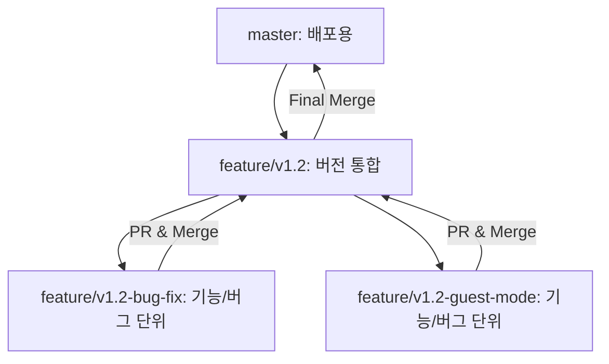

# Bible Reading Mate 개발 방법론 (Dev Methodology)

- 최초 생성일: 2026-01-05
- 최신 수정일: 2026-01-08

본 프로젝트는 코드의 안정성과 개발자의 학습을 위해 다음과 같은 **브런칭 전략**, **버전 관리 기준**, 그리고 **작업 흐름**을 따릅니다.

## 0. 문서 작성 원칙

모든 문서는 `docs/` 폴더 안에 작성됩니다.
- `docs-index.md`에 문서 목록을 정리합니다.
- `docs/guides/` 폴더에 개발 방법론, 사용자 가이드, 배포 관리 등에 대한 문서를 작성합니다.
- `docs/logs/` 폴더에 개발 로그를 작성합니다.
- `docs/specifications/` 폴더에 구현 명세서를 작성합니다.
- 문서에는 최초 생성일과 최신 수정일을 기록합니다.
- 문서 작성 시 담백한 엔지니어링 스타일을 유지합니다. 개발 내역을 과장하지 마십시오.

---

## 1. 기능 선정 및 계획 (Selection & Planning)

개발을 시작하기 전, **Inbox**를 통해 아이디어를 수집하고 차기 버전의 범위를 확정하는 단계를 거칩니다.

1.  **아이디어 수집 (Inbox)**: 희망 기능이나 발견된 버그를 `roadmap.md`의 **Inbox** 섹션에 자유롭게 기록합니다.
2.  **분류 및 가치 매핑 (Categorization)**: 수집된 아이템을 다음 기준에 따라 분류합니다.
    - **라벨링**: `[Major]`, `[Minor]`, `[Patch]`
    - **핵심 가치 매핑**: `📖 읽기 (Reading)`, `📝 노트 (Notes)`, `📊 진도 (Tracking)`, `🎨 UX/UI` 중 해당하는 영역에 배치합니다.
3.  **목표 설정 (Scoping)**: 차기 버전에 포함할 핵심 기능을 선별하고, `roadmap.md` 상단에 **목표 버전**과 **개발 일정**을 명시합니다.
4.  **범위 명세서 작성 (Version Specification)**: 확정된 범위를 바탕으로 `docs/specifications/spec-v버전명.md`를 작성하여 해당 버전의 구현 범위와 기술적 변경 사항을 정의합니다.

---

## 2. 브랜치 전략 (Branching Strategy)

프로젝트는 **버전(Version)** 브랜치와 **기능(Feature)** 브랜치로 이중화하여 관리합니다.

- **`master`**: 항상 배포 가능한 최신/안정 상태를 유지합니다.
- **`feature/vX.Y` (통합 브랜치)**: 특정 버전의 모든 기능을 모으는 중간 기지입니다. 명세서(`spec`)와 로드맵이 관리됩니다.
- **`feature/vX.Y-기능명` (작업 브랜치)**: 실제로 코드를 수정하는 단위입니다. 작업 완료 후 통합 브랜치로 병합됩니다.

---

## 3. 작업 수행 흐름 (Development Workflow)

모든 작업(Feature/Bug fix) 브랜치는 다음의 **6단계 승인 게이트**를 거칩니다.

### 1단계: 구현 계획 작성 (Implementation Planning)
- 코드 수정 전, AI가 다음 내용을 포함한 `implementation_plan.md`를 **아티팩트**로 작성하여 제출합니다. (개별 기능 단위의 상세 설계)
  - **변경 범위**: 수정할 파일/컴포넌트와 유지할 부분 정의
  - **흐름 변화**: 데이터 흐름 및 사용자 인터랙션의 전/후 비교
  - **검증 전략**: 자동화 테스트 및 AI 자체 검증 방법
  - **수동 검증 포인트**: 사용자가 직접 확인해야 할 핵심 항목 명시

### 2단계: 구현 및 가상 검증
- 승인된 계획에 따라 기능을 구현하고, AI가 자체 검증 결과를 포함한 `walkthrough.md`를 제출합니다.

### 3단계: 사용자 수동 검증 및 승인
- 사용자가 로컬 서버(`npm run dev`)에서 기능을 직접 확인합니다.
- 동작이 의도와 같을 경우 작업 승인을 내리고, PR 작성을 지시합니다.

### 4단계: PR 초안 작성 및 리뷰
- AI가 코드 변경점과 검증 내용이 담긴 **PR(Pull Request) 초안**을 작성합니다.
- 사용자가 PR 내용을 최종 리뷰합니다.

### 5단계: 최종 병합 (Merge)
- 사용자의 최종 승인 시, 작업 브랜치를 통합 브랜치로 병합하고 작업 브랜치를 삭제합니다.

### 6단계: 개발 로그 업데이트 (Retrospective)
- 병합 완료 후, 해당 기능 개발 과정에서의 기록을 `dev-log-v버전명.md`에 추가합니다.
  - **Retrospective**: 계획대로 풀리지 않았던 부분, 예상치 못한 버그와 그 원인
  - **Troubleshooting**: 해결을 위해 시도한 방법과 최종 해결책
  - **Lessons Learned**: 이번 작업을 통해 배운 기술적/관리적 교훈

---

## 4. 버전 관리 기준 (Versioning Policy)

### Major 버전 (2.0, 3.0, ...)
대규모 아키텍처 변경이나 핵심 사용자 경험이 근본적으로 바뀔 때 올립니다.
- DB 스키마 대폭 변경, 핵심 기능 재설계, 다중 사용자 지원 도입 등.

### Minor 버전 (1.1, 1.2, ...)
기존 구조 내에서 기능을 추가하거나 개선할 때 올립니다.
- 신규 기능 추가, UI/UX 개선, 성능 향상, 버그 수정 묶음 등.

### Patch 버전 (1.1.1, 1.1.2, ...)
긴급 버그 수정이나 사소한 변경에 사용합니다.
- 핫픽스, 오타/문구 수정, 의존성 보안 패치 등.

---

## 5. AI 협업 규칙 (Collaboration Gate)
- **승인 없이 변경 금지**: 명세의 요구사항을 변경/생략할 경우 반드시 사전 질문 후 승인을 받습니다.
- **결정 필요 시 즉시 정지**: 판단이 필요한 지점에서는 구현을 멈추고 **"이유 → 선택지 → 장단점 → 추천안"** 순서로 제안합니다.
- **개발 로그 기록**: 모든 구현 결과와 결정 사항은 '6단계: 개발 로그 업데이트'를 통해 `docs/logs/dev-log-vX.Y.md`에 공식 기록합니다.

---

## 6. 배포 절차 (Release Process)
1. **버전 업데이트**: `package.json`, `Settings.jsx`, `README.md`, `roadmap.md`의 버전 정보 갱신
2. **최종 병합**: 통합 브랜치(`feature/v1.x`)를 `master`로 병합 (Squash Merge 권장)
3. **태그 및 릴리즈**: Git 태그 생성 (`v1.2` 등) 및 GitHub Release 생성
4. **문서 정리**: Roadmap의 Completed 섹션 및 `docs-index.md` 링크 업데이트

---

## 7. Lessons Learned (교훈)
- **문서화는 필수**: 코드는 잊혀지지만 문서는 남습니다. AI 협업 컨텍스트 유지에 핵심입니다.
- **체크리스트의 힘**: 머리로 기억하지 말고 `task.md` 등의 시스템을 믿으세요.
- **아티팩트 주의**: 중요한 문서는 프로젝트 폴더 내 실제 파일로 즉시 저장하여 관리합니다.
- **Plain Engineering Style**: 릴리즈 노트와 개발로그는 과장 없이 기술적 사실만을 기록하며, 트러블슈팅 내역을 상세히 포함한다.
- **Data & Environment Consistency**: 데이터베이스 경로(`server/data/`)와 서버 설정(.env)은 반드시 프로젝트 표준을 따른다. 임의의 경로 변경이나 중복 폴더 생성을 금지한다.

> 💡 **핵심**: 이 프로세스는 코드의 품질을 보장할 뿐만 아니라, 개발자가 전체 개발 주기를 건강하게 경험하며 성장하는 데 목적이 있습니다.
