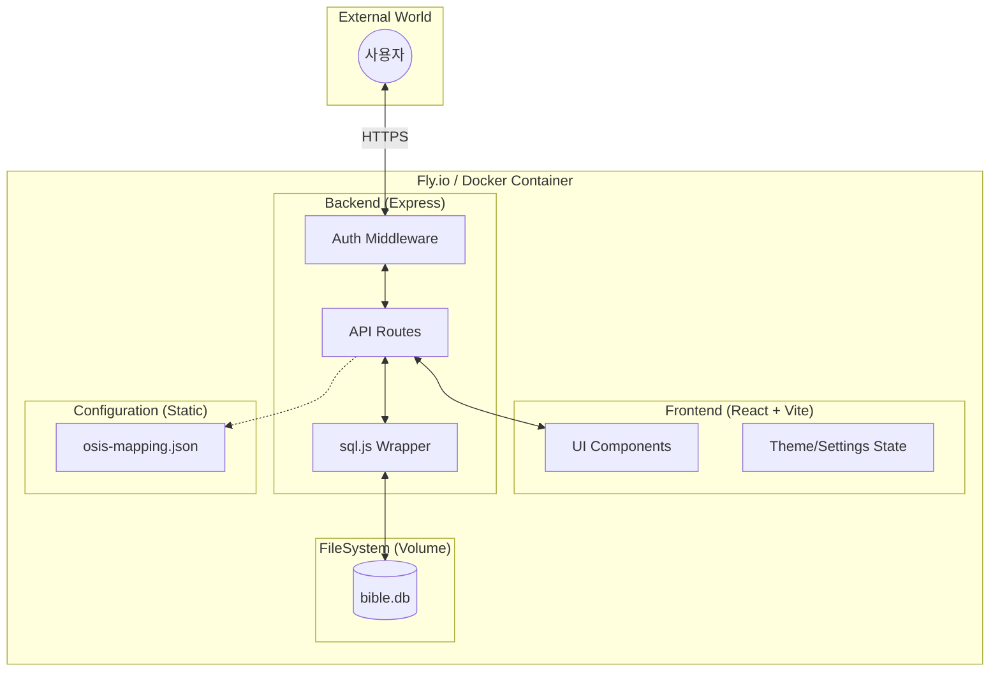
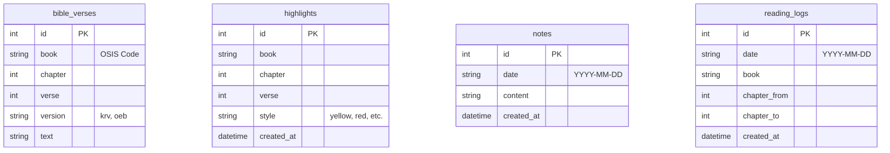

# 🏗️ System Architecture (v1.2)

> **Last Updated: 2026-01-08**

BibleMate의 현재 시스템 구조와 설계 철학을 정리한 문서입니다.

---

## 1. High-level Architecture



---

## 2. 핵심 설계 철학

### 1) 데이터와 설정의 분리 (Separation of Concerns)
- **설정(Config)**: 빌드 시 포함되며 읽기 전용으로 취급 (`server/config/`)
- **데이터(Data)**: 앱 실행 중 변경되는 가변 데이터 (`server/data/`)
- **이유**: 클라우드 배포 시 볼륨 마운트 시 설정 파일이 유실되는 것을 방지하고, 데이터만 독립적으로 관리하기 위함.

### 2) 환경 기반 보안 (Environment-driven Security)
- 로컬 환경에서는 최대한의 편의성 제공 (암호 불필요).
- 외부 노출 환경(Fly.io 등)에서는 환경 변수(`ACCESS_PASSWORD`)만으로 즉시 보안 활성화.
- **세션 정책**: 보안 강화와 매일의 묵상 루틴 장려를 위해 모든 세션은 당일 자정(00:00:00)에 강제 만료됨.
- 인증 정보는 브라우저 `HttpOnly`, `SameSite: Strict` 쿠키를 통해 안전하게 관리.

### 3) 독립적 빌드 (Isolated Build Pipeline)
- **Client Builder**: 프론트엔드 자원 최적화
- **DB Builder**: 성경 데이터 원본에서 DB 자동 생성 (Git 용량 최적화)
- **Production Stage**: 필요한 실행 파일만 포함된 초경량 이미지 구성

---

## 3. 디렉토리 구조 및 역할

```bash
biblemate/
├── client/           # 프론트엔드 (React, UI, UX)
├── server/           # 백엔드 (Express, API, Auth)
│   ├── config/       # 서비스 설정 (Read-only)
│   ├── db/           # DB 초기화 및 스키마
│   ├── data/         # SQLite 실제 파일 (Writable, Volume Mount)
│   └── routes/       # 도메인별 API 로직
├── scripts/          # 데이터 임포트 및 유틸리티
└── docs/             # 설계 및 사용자 문서
```

---

## 4. 데이터 구조 (Data Structure)

### 1) Database ERD (SQLite)



### 2) Backup JSON Schema
내보내기/가져오기에 사용되는 JSON의 기본 구조입니다.

```json
{
  "version": "1.1",
  "exported_at": "2026-01-06T...",
  "data": {
    "reading_logs": [...],
    "notes": [...],
    "highlights": [...]
  }
}
```

---

## 5. 데이터 지속성 전략
- SQLite는 WASM 기반의 `sql.js`를 사용하며, 서버 종료 시점에 메모리 데이터를 파일로 쓰기(Write-back)함.
- **표준 경로**: 모든 데이터베이스 파일은 `server/data/bible.db`를 유지해야 함. (임의의 `db-data` 등 폴더 생성 금지)
- **볼륨 마운트**: Fly.io 배포 시 `biblemate_data` 볼륨을 `/app/server/data`에 마운트하여 기기 재시작 시에도 데이터를 유지함.

---

## 6. 환경 일관성 (Environment Parity) 규칙
AI 및 개발자가 기능을 추가할 때 반드시 준수해야 할 규칙입니다.

### 1) 데이터베이스 경로 엄수
- `server/db/init.js`의 `DB_PATH`는 반드시 `.gitignore`와 일치하는 `server/data/bible.db`를 지향함.
- 폴더가 없을 경우 자동 생성하는 로직은 편리하지만, 기존 데이터가 있는 `data` 폴더가 아닌 엉뚱한 곳에 새 폴더를 만들지 않도록 주의해야 함.

### 2) 세션 및 상태 관리
- 서버 재시작 시 인메모리 세션이 초기화되므로, 프론트엔드는 항상 `authStatus`를 체크하고 적절한 로그인 화면으로 유도해야 함.
