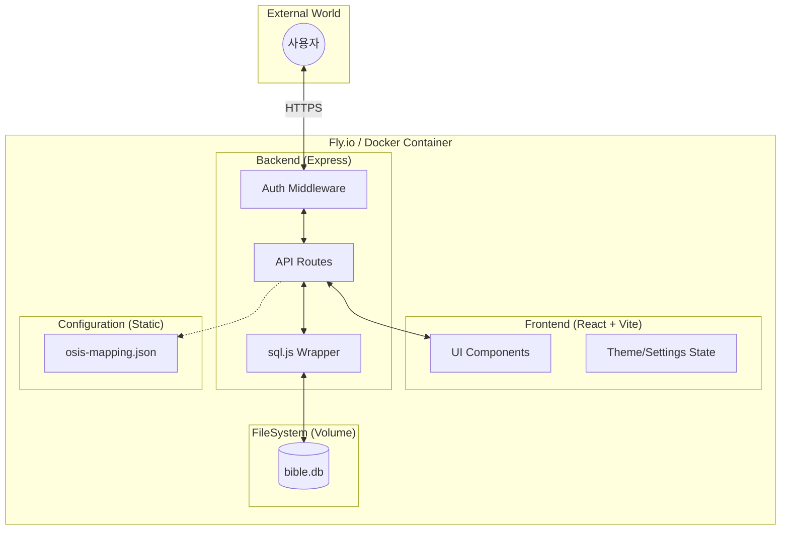

# 🏗️ System Architecture (v1.1)

BibleMate의 현재 시스템 구조와 설계 철학을 정리한 문서입니다.

---

## 1. High-level Architecture



---

## 2. 핵심 설계 철학

### 1) 데이터와 설정의 분리 (Separation of Concerns)
- **설정(Config)**: 빌드 시 포함되며 읽기 전용으로 취급 (`server/config/`)
- **데이터(Data)**: 앱 실행 중 변경되며 영구 보존이 필요 (`server/db-data/`)
- **이유**: 클라우드 배포 시 볼륨 마운트 시 설정 파일이 유실되는 것을 방지하기 위함.

### 2) 환경 기반 보안 (Environment-driven Security)
- 로컬 환경에서는 최대한의 편의성 제공 (암호 불필요).
- 외부 노출 환경(Fly.io 등)에서는 환경 변수(`ACCESS_PASSWORD`)만으로 즉시 보안 활성화.
- 인증 정보는 브라우저 `HttpOnly` 쿠키를 통해 안전하게 관리.

### 3) 독립적 빌드 (Isolated Build Pipeline)
- **Client Builder**: 프론트엔드 자원 최적화
- **DB Builder**: 성경 데이터 원본에서 DB 자동 생성 (Git 용량 최적화)
- **Production Stage**: 필요한 실행 파일만 포함된 초경량 이미지 구성

---

## 3. 디렉토리 구조 및 역할

```bash
biblemate/
├── client/           # 프론트엔드 (React, UI, UX)
├── server/           # 백엔드 (Express, API, Auth)
│   ├── config/       # 서비스 설정 (Read-only)
│   ├── db/           # DB 초기화 및 스키마
│   ├── db-data/      # SQLite 실제 파일 (Writable, Volume Mount)
│   └── routes/       # 도메인별 API 로직
├── scripts/          # 데이터 임포트 및 유틸리티
└── docs/             # 설계 및 사용자 문서
```

---

## 4. 데이터 지속성 전략
- SQLite는 WASM 기반의 `sql.js`를 사용하며, 서버 종료 시점에 메모리 데이터를 파일로 쓰기(Write-back)함.
- Fly.io 배포 시 `biblemate_data` 볼륨을 `/app/server/db-data`에 마운트하여 기기 재시작 시에도 데이터를 유지함.
